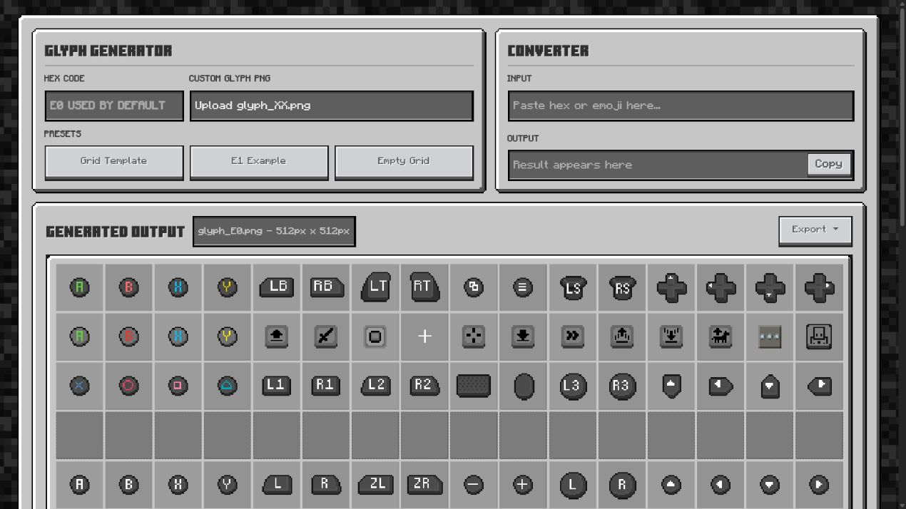

# Glyph Tools

A Minecraft Bedrock resource pack often reaches a point where ordinary text is no longer enough. Controller buttons, menu symbols, status marks, and custom artwork need stable code points and a predictable place inside a glyph atlas. Glyph Tools brings that work into one focused workspace.

Open the live app at [nhanaz.github.io/glyph](https://nhanaz.github.io/glyph/).



## A glyph page starts as a picture

Imagine that you have a folder of icons ready for a pack. Each icon looks correct on its own, but Minecraft needs them arranged on a 16 by 16 page with 256 addressable slots. Choosing the `E0` page gives those slots the range `E000` through `E0FF`.

Glyph Tools can begin with a labeled grid template, a working example, or an empty atlas. An existing `glyph_XX.png` can also be opened directly, which makes the same workspace useful for both new packs and older atlases that need another editing pass.

## Every slot keeps its identity

Selecting a cell reveals the character, hexadecimal code, decimal value, grid position, dimensions, and Unicode escape assigned to that slot. The texture can then be replaced with another PNG, picked from the bundled Minecraft texture library, cleared to transparency, or opened in a drawing workflow.

This keeps the visual edit connected to the code point that Minecraft will read. There is no need to count rows by hand or guess which character belongs to an icon.

## From atlas to resource pack

The converter moves between hexadecimal code points and their matching characters. It is useful when a command, JSON file, or text field needs the actual glyph rather than its numeric address.

When the page is ready, the export menu can produce the atlas PNG, a complete Minecraft character string, a readable reference map, font JSON for a resource pack, or metadata JSON for later editing. The result is not just a preview. It is the material needed to continue building the pack.

## Run Glyph Tools locally

Serve the repository over HTTP so the bundled texture picker can load its manifest.

```bash
python -m http.server 8000
```

Open [Glyph Tools](http://localhost:8000/) in a browser.

Node users can run the workspace with another local server.

```bash
npx serve .
```

## Refresh the Minecraft texture library

The texture picker already includes the files it needs. To refresh them from the official Bedrock samples, install Node.js 18 or newer and Git, then run the command below.

```bash
node scripts/fetch-vanilla.js
```

The refresh uses the resource pack textures published in [Mojang Bedrock Samples](https://github.com/Mojang/bedrock-samples/tree/main/resource_pack/textures) and rebuilds the picker manifest.

## Check a change

Install the development dependencies once, then run the complete syntax, lint, and test check.

```bash
npm install
npm run check
```

## License

The Glyph Tools source is licensed under GPL 3.0. The complete terms are available in [LICENSE](LICENSE).

Minecraft textures remain subject to the [Minecraft End User License Agreement](https://www.minecraft.net/eula).
